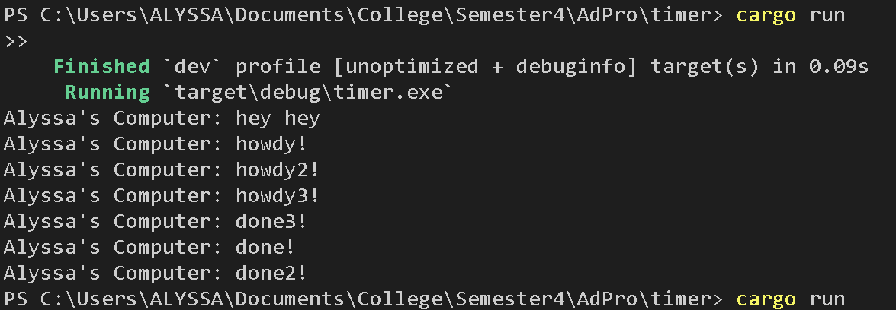
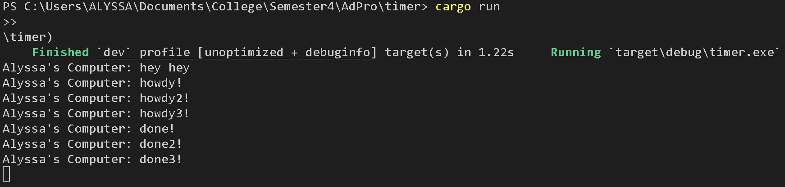

**Nama**: Alyssa Layla Sasti    
**Kelas**: AdPro B   
**NPM**: 2306152052  

## REFLECTION MODULE 10 TIMER
1.2 Understanding How It Works

Di dalam file main.rs, `println!("Alyssa's Computer: hey hey");` diletakkan setelah `spawner.spawn(...)`. Namun jika kita lihat di hasil cargo run, output yang di dapat adalah text "Alyssa's Computer: hey hey" muncul di baris pertama, dilanjutkan oleh baris kedua dan ketiga yang berada di dalam spawn. Hal ini terjadi karena "Alyssa's Computer: hey hey" berada di luar async block. Maka baris tersebut lebih dahulu dieksekusi tanpa dimasukkan ke queue eksekusi. Statement yang ada di dalam async block baru dieksekusi saat sampai di baris `executor.run()`. Baris tersebut berada setelah `println!("Alyssa's Computer: hey hey");`. Sehingga output yang ada ketika cargo run adalah "Alyssa's Computer: hey hey" terlebih dahulu baru setelah itu berurut yang ada di dalam async block.

1.3 Multiple Spawn and removing drop
- Ketika drop(spawner) aktif

- Ketika drop(spawneer) di-comment

Ketika `drop(spawner)` diaktifkan (tidak di-comment), maka setelah semua task yang telah dikirim ke spawner selesai dijalankan,       `executor.run()` akan berhenti karena tidak akan ada lagi task baru yang bisa masuk ke dalam antrean. Hal ini menyebabkan eksekusi berhenti setelah semua task done! selesai, sehingga program berakhir secara normal. Namun, jika `drop(spawner)` di-comment, maka executor tidak akan pernah mengetahui bahwa tidak ada lagi task baru yang akan datang. Akibatnya, `executor.run()` akan berjalan dan tidak pernah berhenti secara otomatis (karena channel tidak pernah tertutup), sehingga program tampak “gantung” dan tidak keluar dari eksekusi. Urutan output yang selalu diawali dengan “Alyssa's Computer: hey hey” lalu diikuti oleh “howdy!”, “howdy2!”, “howdy3!” secara berurutan. Hal ini terjadi karena println!("Alyssa's Computer: hey hey") dieksekusi secara langsung sebelum masuk ke dalam executor.run(), sementara howdy-howdy lainnya masuk dalam antrean task asynchronous. Sedangkan urutan output “done!”, “done2!”, dan “done3!” bisa bervariasi karena masing-masing menggunakan TimerFuture yang menunggu selama dua detik secara paralel, dan hasilnya akan bergantung pada scheduler serta timing internal eksekusi task tersebut.