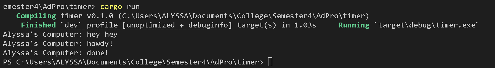

**Nama**: Alyssa Layla Sasti    
**Kelas**: AdPro B   
**NPM**: 2306152052  

## REFLECTION MODULE 10 TIMER
1.2 Understanding How It Works

Di dalam file main.rs, `println!("Alyssa's Computer: hey hey");` diletakkan setelah `spawner.spawn(...)`. Namun jika kita lihat di hasil cargo run, output yang di dapat adalah text "Alyssa's Computer: hey hey" muncul di baris pertama, dilanjutkan oleh baris kedua dan ketiga yang berada di dalam spawn. Hal ini terjadi karena "Alyssa's Computer: hey hey" berada di luar async block. Maka baris tersebut lebih dahulu dieksekusi tanpa dimasukkan ke queue eksekusi. Statement yang ada di dalam async block baru dieksekusi saat sampai di baris `executor.run()`. Baris tersebut berada setelah `println!("Alyssa's Computer: hey hey");`. Sehingga output yang ada ketika cargo run adalah "Alyssa's Computer: hey hey" terlebih dahulu baru setelah itu berurut yang ada di dalam async block.